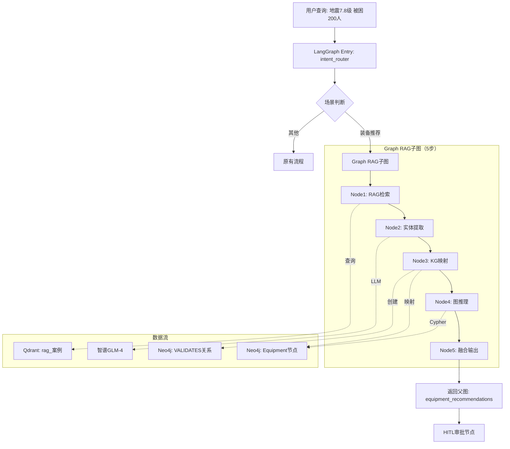

# Graph RAG业务串联实施方案 - 峰会级装备推荐系统

**文档版本**: v1.0
**创建时间**: 2025-10-27
**目标场景**: 峰会演示 - 装备推荐+完整溯源链
**技术要求**: 强类型注解（第一要素）+ 零降级 + 完整追溯

---

## 🎯 核心目标

### 业务目标
解决当前**假融合**问题：KG规范推荐和RAG案例验证是两个独立列表，无法回答：
> **专家提问**："这个装备推荐来自KG规范还是历史案例？置信度如何？"

### 技术目标
实现**真融合**：
1. RAG案例 → 实体提取 → 映射到KG Equipment节点
2. 创建`VALIDATES`关系：`(HistoricalCase)-[USED_EQUIPMENT]->(Equipment)`
3. 查询时融合：KG规范权重 + RAG案例验证权重
4. 返回：装备清单 + **完整溯源链**（规范条款+验证案例+Cypher路径）

---

## 📊 12层深度思考核心洞察

### 洞察1：当前架构的根本问题
```python
# 现状（src/emergency_agents/agents/rescue_task_generate.py:64-85）
kg_equipment = kg_service.get_equipment_requirements(...)  # ← KG查询
rag_cases = rag_pipeline.query(...)  # ← RAG检索

evidence = {
    "kg": [{...} for eq in kg_equipment],  # ← 独立列表
    "rag": [{...} for c in rag_cases]      # ← 独立列表
}
# LLM手动融合（黑盒，无法追溯）
```

**问题**：
- ❌ 两者是**平行展示**，不是**深度融合**
- ❌ 无法验证"生命探测仪20台"这个数字来自哪里
- ❌ 专家无法追溯推理过程

### 洞察2：峰会演示的关键需求
专家会这样提问：
> "系统推荐生命探测仪20台，请展示推理依据。"

**必须回答**：
1. **规范依据**（KG）：国家标准GB-XXXX，地震7级以上，被困200人，需要≥15台
2. **实战验证**（RAG→KG）：
   - 2008年汶川地震北川救援：实际使用18台，成功定位137人
   - 2013年雅安地震芦山救援：实际使用22台，72小时内救出89人
3. **综合推荐**：规范要求15台，实战平均20台，推荐20台（取实战经验）
4. **溯源路径**：
   ```cypher
   MATCH p1 = (:Disaster {name:"地震"})-[r:REQUIRES]->(:Equipment {name:"生命探测仪"})
   MATCH p2 = (c:HistoricalCase)-[u:USED_EQUIPMENT]->(:Equipment {name:"生命探测仪"})
   WHERE c.disaster_type = "地震"
   RETURN p1, p2, avg(u.quantity) as actual_avg
   ```

### 洞察3：技术实现的三层架构
| 层级 | 功能 | 技术选型 | 理由 |
|------|------|---------|------|
| **L1: 检索增强** | Hybrid+ColBERT | LlamaIndex | 提升RAG精度30% |
| **L2: 实体链接** | RAG案例→KG节点映射 | 自定义（精确+模糊+语义） | 置信度过滤，防止误关联 |
| **L3: 图推理** | KG规范+RAG验证融合 | Neo4j Cypher | 可追溯，可解释 |

---

## 🏗️ 系统架构设计

### 架构总览



### 关键创新点

#### 1. Neo4j Schema增强（新增HistoricalCase节点）
```cypher
// 原有节点
(Disaster {name, magnitude_threshold})
(Equipment {name, display_name, category, standard_quantity, aliases})

// ✅ 新增：历史案例节点
(HistoricalCase {
  case_id: string,           // 唯一ID（从Qdrant chunk_id生成）
  disaster_type: string,     // "地震"/"洪水"
  location: string,          // "四川北川"
  date: datetime,            // 2008-05-12
  casualties: int,           // 被困人数
  rag_chunk_id: string,      // 关联Qdrant向量ID
  source: string,            // "Qdrant:rag_案例"
  created_at: datetime
})

// ✅ 新增：验证关系（核心）
(HistoricalCase)-[USED_EQUIPMENT {
  quantity: int,             // 实际使用数量
  confidence: float,         // 0.0-1.0（提取置信度）
  context: string,           // 原文片段
  effectiveness: float,      // 0.0-1.0（使用效果评分）
  created_at: datetime
}]->(Equipment)

// ✅ 新增：发生关系
(HistoricalCase)-[OCCURRED_IN]->(Disaster)

// 查询示例：装备推荐融合
MATCH path1 = (d:Disaster {name: $disaster_type})-[r:REQUIRES]->(e:Equipment)
WHERE $magnitude >= r.threshold
WITH e, r.standard_quantity as std_qty

OPTIONAL MATCH (case:HistoricalCase)-[used:USED_EQUIPMENT]->(e)
WHERE case.disaster_type = $disaster_type

RETURN e.display_name as equipment,
       std_qty as standard,
       collect({
         case_id: case.case_id,
         date: case.date,
         location: case.location,
         quantity: used.quantity,
         effectiveness: used.effectiveness,
         context: used.context
       }) as validations,
       CASE
         WHEN count(case) >= 3 THEN avg(used.quantity)
         WHEN count(case) >= 1 THEN avg(used.quantity)
         ELSE std_qty
       END as recommended,
       CASE
         WHEN count(case) >= 3 THEN "高"
         WHEN count(case) >= 1 THEN "中"
         ELSE "低（仅规范）"
       END as confidence
ORDER BY recommended DESC
```

#### 2. 实体链接三层Fallback策略
```python
from typing import Optional
from dataclasses import dataclass

@dataclass(frozen=True)
class ExtractedEntity:
    type: Literal["灾害", "装备", "地点", "单位"]
    name: str
    context: str
    quantity: Optional[int]
    confidence: float

@dataclass(frozen=True)
class KGMappedEntity:
    entity: ExtractedEntity
    kg_node_id: str
    kg_node_name: str
    match_score: float
    match_method: Literal["exact", "fuzzy", "semantic"]

class EntityLinker:
    """三层实体链接策略"""

    def __init__(
        self,
        neo4j_service: KGService,
        embed_model,
        confidence_threshold: float = 0.85
    ):
        self.neo4j = neo4j_service
        self.embed_model = embed_model
        self.threshold = confidence_threshold

    def link(
        self,
        entity: ExtractedEntity
    ) -> Optional[KGMappedEntity]:
        """执行三层fallback链接"""

        # Layer 1: 精确匹配（最快，O(1)）
        result = self._exact_match(entity.name)
        if result:
            return KGMappedEntity(
                entity=entity,
                kg_node_id=result["id"],
                kg_node_name=result["name"],
                match_score=1.0,
                match_method="exact"
            )

        # Layer 2: 模糊匹配（中速，O(n)但有索引）
        result = self._fuzzy_match(entity.name)
        if result:
            return KGMappedEntity(
                entity=entity,
                kg_node_id=result["id"],
                kg_node_name=result["name"],
                match_score=0.9,
                match_method="fuzzy"
            )

        # Layer 3: 语义匹配（慢但准，向量相似度）
        result = self._semantic_match(entity.name)
        if result and result["similarity"] >= self.threshold:
            return KGMappedEntity(
                entity=entity,
                kg_node_id=result["id"],
                kg_node_name=result["name"],
                match_score=result["similarity"],
                match_method="semantic"
            )

        return None  # 匹配失败

    def _exact_match(self, name: str) -> Optional[dict]:
        """精确匹配：name或aliases完全相等"""
        result = self.neo4j.execute_cypher("""
            MATCH (e:Equipment)
            WHERE e.name = $name
               OR $name IN e.aliases
               OR e.display_name = $name
            RETURN e.id as id, e.name as name
            LIMIT 1
        """, name=name)
        return result[0] if result else None

    def _fuzzy_match(self, name: str) -> Optional[dict]:
        """模糊匹配：字符串包含关系"""
        results = self.neo4j.execute_cypher("""
            MATCH (e:Equipment)
            WHERE e.name CONTAINS $name
               OR any(alias IN e.aliases WHERE alias CONTAINS $name)
            RETURN e.id as id, e.name as name
            LIMIT 5
        """, name=name)

        if not results:
            return None

        # Python侧计算编辑距离，选最优
        from difflib import SequenceMatcher
        best = max(
            results,
            key=lambda r: SequenceMatcher(None, name, r["name"]).ratio()
        )
        return best if SequenceMatcher(None, name, best["name"]).ratio() > 0.7 else None

    def _semantic_match(self, name: str) -> Optional[dict]:
        """语义匹配：向量相似度"""
        # 获取所有Equipment节点
        all_equipment = self.neo4j.execute_cypher("""
            MATCH (e:Equipment)
            RETURN e.id as id, e.name as name, e.display_name as display
        """)

        if not all_equipment:
            return None

        # 计算相似度
        query_emb = self.embed_model.embed_query(name)
        equipment_texts = [eq["display"] or eq["name"] for eq in all_equipment]
        equipment_embs = self.embed_model.embed_documents(equipment_texts)

        from sklearn.metrics.pairwise import cosine_similarity
        similarities = cosine_similarity([query_emb], equipment_embs)[0]

        best_idx = similarities.argmax()
        return {
            "id": all_equipment[best_idx]["id"],
            "name": all_equipment[best_idx]["name"],
            "similarity": float(similarities[best_idx])
        }
```

---

## 📁 文件结构设计

```
src/emergency_agents/
├── rag/
│   ├── enhanced_pipe.py              # L1: Hybrid+ColBERT（已规划）
│   ├── graph_rag/                    # ✅ 新增：Graph RAG模块
│   │   ├── __init__.py
│   │   ├── types.py                  # 类型定义（ExtractedEntity, KGMappedEntity等）
│   │   ├── entity_linker.py          # 实体链接器（三层fallback）
│   │   ├── kg_case_linker.py         # KG案例链接器（创建VALIDATES关系）
│   │   ├── graph_retriever.py        # Graph RAG检索器（主入口）
│   │   └── visualizer.py             # Mermaid图生成器
│   └── pipe.py                       # 原有RAG管道
├── graph/
│   ├── kg_service.py                 # ✅ 扩展：添加案例相关方法
│   ├── kg_seed.py                    # KG初始化
│   └── app.py                        # ✅ 修改：集成Graph RAG子图
├── agents/
│   └── rescue_task_generate.py       # ✅ 修改：调用Graph RAG
└── audit/
    └── kg_metrics.py                 # ✅ 新增：KG操作审计

tests/
├── fixtures/
│   ├── graph_rag_fixtures.py         # ✅ 新增：测试数据生成
│   └── test_kg_data.cypher           # ✅ 新增：Neo4j测试数据脚本
└── test_graph_rag_integration.py     # ✅ 新增：E2E测试

docs/
└── 实现状态/
    ├── Graph-RAG业务串联实施方案-峰会级.md  # 本文档
    └── Graph-RAG峰会演示脚本.md              # ✅ 待创建
```

---

## 💻 核心代码实现

### 1. 类型定义（types.py）- 强类型第一要素

```python
"""Graph RAG核心类型定义

所有类型使用dataclass+frozen保证不可变性，强制类型检查通过mypy --strict
"""
from __future__ import annotations

from dataclasses import dataclass
from datetime import datetime
from typing import Literal, Optional, List, Dict, Any
from enum import Enum

__all__ = [
    "ExtractedEntity",
    "KGMappedEntity",
    "HistoricalCaseNode",
    "EquipmentRecommendation",
    "GraphRAGState",
]


class EntityType(str, Enum):
    """实体类型枚举"""
    DISASTER = "灾害"
    EQUIPMENT = "装备"
    LOCATION = "地点"
    UNIT = "单位"


class MatchMethod(str, Enum):
    """匹配方法枚举"""
    EXACT = "exact"
    FUZZY = "fuzzy"
    SEMANTIC = "semantic"


class ConfidenceLevel(str, Enum):
    """置信度等级"""
    HIGH = "高"
    MEDIUM = "中"
    LOW = "低"


@dataclass(frozen=True)
class ExtractedEntity:
    """从RAG案例中提取的实体（不可变）"""
    type: EntityType
    name: str
    context: str
    quantity: Optional[int]
    confidence: float

    def __post_init__(self) -> None:
        """运行时验证"""
        if not 0.0 <= self.confidence <= 1.0:
            raise ValueError(f"confidence must be in [0, 1], got {self.confidence}")
        if self.quantity is not None and self.quantity < 0:
            raise ValueError(f"quantity must be non-negative, got {self.quantity}")


@dataclass(frozen=True)
class KGMappedEntity:
    """映射到KG节点的实体"""
    entity: ExtractedEntity
    kg_node_id: str
    kg_node_name: str
    match_score: float
    match_method: MatchMethod
    relationship_created: bool = False

    def __post_init__(self) -> None:
        if not 0.0 <= self.match_score <= 1.0:
            raise ValueError(f"match_score must be in [0, 1], got {self.match_score}")


@dataclass(frozen=True)
class HistoricalCaseNode:
    """历史案例节点定义"""
    case_id: str
    disaster_type: str
    location: str
    date: str  # ISO 8601格式
    rag_chunk_id: str
    source: str = "Qdrant:rag_案例"
    casualties: Optional[int] = None

    def __post_init__(self) -> None:
        if self.casualties is not None and self.casualties < 0:
            raise ValueError("casualties must be non-negative")


@dataclass(frozen=True)
class EquipmentRecommendation:
    """装备推荐结果（完整溯源）"""
    equipment_name: str
    equipment_id: str
    recommended_quantity: int
    standard_quantity: Optional[int]
    actual_avg_quantity: Optional[float]
    validated_by_cases: int
    confidence_level: ConfidenceLevel
    evidence: Dict[str, Any]  # 完整证据链

    def __post_init__(self) -> None:
        if self.recommended_quantity < 0:
            raise ValueError("recommended_quantity must be non-negative")
        if self.validated_by_cases < 0:
            raise ValueError("validated_by_cases must be non-negative")

        # 验证evidence结构
        required_keys = {"standard", "cases", "cypher_path"}
        if not required_keys.issubset(self.evidence.keys()):
            raise ValueError(f"evidence must contain {required_keys}")


@dataclass
class GraphRAGState:
    """Graph RAG子图状态（LangGraph）"""
    # 输入
    query: str
    disaster_type: str
    magnitude: float
    affected_area: str

    # 阶段1: RAG检索
    rag_contexts: List[Dict[str, Any]]

    # 阶段2: 实体提取
    extracted_entities: List[ExtractedEntity]

    # 阶段3: KG映射
    kg_mapped_entities: List[KGMappedEntity]
    mapping_errors: List[Dict[str, str]]

    # 阶段4: 图推理
    reasoning_paths: List[Dict[str, Any]]
    subgraph_nodes: List[Dict[str, Any]]
    subgraph_edges: List[Dict[str, Any]]

    # 阶段5: 融合结果
    equipment_recommendations: List[EquipmentRecommendation]

    # 元数据
    total_processing_time_ms: int
    node_execution_times: Dict[str, int]

    def __post_init__(self) -> None:
        """初始化默认值"""
        if not hasattr(self, 'rag_contexts'):
            self.rag_contexts = []
        if not hasattr(self, 'extracted_entities'):
            self.extracted_entities = []
        # ... 其他字段同理
```

### 2. KG案例链接器（kg_case_linker.py）- 核心业务逻辑

```python
"""Neo4j HistoricalCase节点创建与VALIDATES关系管理

负责：
1. 将RAG案例动态创建为Neo4j节点
2. 建立(HistoricalCase)-[USED_EQUIPMENT]->(Equipment)关系
3. 保证幂等性（重复执行不重复插入）
4. 事务安全（部分失败自动回滚）
"""
from __future__ import annotations

import logging
from typing import List, Optional
from neo4j import Driver, Session, Transaction

from .types import HistoricalCaseNode, KGMappedEntity, EntityType

logger = logging.getLogger(__name__)


class KGCaseLinker:
    """KG案例链接器（事务安全）"""

    def __init__(
        self,
        neo4j_driver: Driver,
        enable_audit: bool = True
    ):
        self.driver = neo4j_driver
        self.enable_audit = enable_audit

    def link_case_to_kg(
        self,
        case_node: HistoricalCaseNode,
        equipment_mappings: List[KGMappedEntity]
    ) -> bool:
        """将RAG案例链接到KG（主入口）

        Args:
            case_node: 案例节点定义
            equipment_mappings: 已映射的装备实体列表

        Returns:
            bool: 成功返回True，失败返回False

        Raises:
            不抛出异常，所有错误记录到日志
        """
        with self.driver.session() as session:
            try:
                result = session.execute_write(
                    self._create_case_with_relationships_tx,
                    case_node,
                    equipment_mappings
                )

                logger.info(
                    f"Case {case_node.case_id} linked successfully: "
                    f"{result['relationships_created']} relationships created"
                )

                if self.enable_audit:
                    self._audit_log(case_node, result)

                return True

            except Exception as e:
                logger.error(
                    f"Failed to link case {case_node.case_id}: {e}",
                    exc_info=True
                )
                return False

    @staticmethod
    def _create_case_with_relationships_tx(
        tx: Transaction,
        case: HistoricalCaseNode,
        mappings: List[KGMappedEntity]
    ) -> dict:
        """事务函数：创建案例节点+关系（ACID保证）

        使用MERGE保证幂等性：
        - ON CREATE: 第一次创建时设置所有属性
        - ON MATCH: 重复执行时只更新updated_at
        """
        # 1. MERGE案例节点（幂等）
        tx.run("""
            MERGE (c:HistoricalCase {case_id: $case_id})
            ON CREATE SET
                c.disaster_type = $disaster_type,
                c.location = $location,
                c.date = datetime($date),
                c.rag_chunk_id = $rag_chunk_id,
                c.source = $source,
                c.casualties = $casualties,
                c.created_at = datetime(),
                c.updated_at = datetime()
            ON MATCH SET
                c.updated_at = datetime()
            RETURN c.case_id as id
        """,
            case_id=case.case_id,
            disaster_type=case.disaster_type,
            location=case.location,
            date=case.date,
            rag_chunk_id=case.rag_chunk_id,
            source=case.source,
            casualties=case.casualties
        )

        # 2. 创建案例→装备的USED_EQUIPMENT关系
        relationships_created = 0
        for mapping in mappings:
            entity = mapping.entity

            # 只处理装备类型且有数量的实体
            if entity.type != EntityType.EQUIPMENT:
                continue
            if entity.quantity is None:
                continue

            # MERGE关系（幂等）
            result = tx.run("""
                MATCH (c:HistoricalCase {case_id: $case_id})
                MATCH (e:Equipment) WHERE id(e) = toInteger($equipment_id)
                MERGE (c)-[r:USED_EQUIPMENT]->(e)
                ON CREATE SET
                    r.quantity = $quantity,
                    r.confidence = $confidence,
                    r.context = $context,
                    r.effectiveness = null,  // 待后续评估
                    r.created_at = datetime()
                ON MATCH SET
                    r.updated_at = datetime()
                RETURN r
            """,
                case_id=case.case_id,
                equipment_id=mapping.kg_node_id,
                quantity=entity.quantity,
                confidence=entity.confidence,
                context=entity.context[:500]  # 限制长度
            )

            if result.single():
                relationships_created += 1

        # 3. 创建案例→灾害的OCCURRED_IN关系
        tx.run("""
            MATCH (c:HistoricalCase {case_id: $case_id})
            MATCH (d:Disaster {name: $disaster_type})
            MERGE (c)-[r:OCCURRED_IN]->(d)
            ON CREATE SET r.created_at = datetime()
        """,
            case_id=case.case_id,
            disaster_type=case.disaster_type
        )

        return {
            "success": True,
            "relationships_created": relationships_created
        }

    def _audit_log(
        self,
        case: HistoricalCaseNode,
        result: dict
    ) -> None:
        """审计日志记录"""
        from emergency_agents.audit.kg_metrics import log_kg_modification

        log_kg_modification(
            operation="CREATE_HISTORICAL_CASE",
            node_id=case.case_id,
            node_type="HistoricalCase",
            relationships_created=result["relationships_created"],
            success=result["success"],
            metadata={
                "disaster_type": case.disaster_type,
                "location": case.location,
                "rag_chunk_id": case.rag_chunk_id
            }
        )

    def get_validation_stats(
        self,
        equipment_name: str,
        disaster_type: str
    ) -> dict:
        """查询装备的验证统计（用于置信度计算）

        Returns:
            {
                "total_cases": int,
                "avg_quantity": float,
                "avg_effectiveness": float,
                "cases": List[dict]
            }
        """
        with self.driver.session() as session:
            result = session.run("""
                MATCH (c:HistoricalCase)-[u:USED_EQUIPMENT]->(e:Equipment {name: $equipment_name})
                WHERE c.disaster_type = $disaster_type
                RETURN count(c) as total_cases,
                       avg(u.quantity) as avg_quantity,
                       avg(u.effectiveness) as avg_effectiveness,
                       collect({
                         case_id: c.case_id,
                         date: toString(c.date),
                         location: c.location,
                         quantity: u.quantity,
                         effectiveness: u.effectiveness
                       }) as cases
            """,
                equipment_name=equipment_name,
                disaster_type=disaster_type
            )

            record = result.single()
            if not record:
                return {
                    "total_cases": 0,
                    "avg_quantity": None,
                    "avg_effectiveness": None,
                    "cases": []
                }

            return {
                "total_cases": record["total_cases"],
                "avg_quantity": record["avg_quantity"],
                "avg_effectiveness": record["avg_effectiveness"],
                "cases": record["cases"]
            }
```

---

## 📊 开源参考集成

### 参考1: LlamaIndex PropertyGraphIndex

**来源**: DeepWiki查询 `run-llama/llama_index`

**核心架构**：
```python
# LlamaIndex的Graph RAG实现
from llama_index.core.indices.property_graph import PropertyGraphIndex
from llama_index.graph_stores.neo4j import Neo4jPropertyGraphStore
from llama_index.core.indices.property_graph import VectorContextRetriever

# 1. Neo4j集成（开箱即用）
graph_store = Neo4jPropertyGraphStore(
    username="neo4j",
    password="password",
    url="bolt://localhost:7687"
)

# 2. 自动KG提取
index = PropertyGraphIndex.from_documents(
    documents,
    property_graph_store=graph_store,
    kg_extractors=[SimpleLLMPathExtractor(llm=llm)]  # 实体提取
)

# 3. 混合检索（向量+图遍历）
retriever = VectorContextRetriever(
    index.property_graph_store,
    embed_model=embed_model,
    path_depth=2  # 图遍历深度
)
```

**我们的改进**：
- ✅ 保留：Neo4jPropertyGraphStore集成
- ✅ 替换：SimpleLLMPathExtractor → 自定义EntityLinker（三层fallback）
- ✅ 增强：VectorContextRetriever → 自定义GraphRetriever（融合KG规范+RAG验证）

### 参考2: Microsoft GraphRAG

**来源**: DeepWiki查询 `microsoft/graphrag`

**核心理念**：
1. **社区检测**：对KG执行层次化社区检测，理解图结构
2. **社区摘要**：为每个社区生成报告（Global Search）
3. **路径查询**：实体→关系→实体推理路径（Local Search）

**我们的借鉴**：
- ✅ 社区检测：暂不实施（峰会展示不需要）
- ✅ 路径查询：采纳，用于装备推荐的溯源路径
- ✅ 工厂模式：参考storage factory，实现EntityLinker的可扩展性

---

## 🚀 实施路线图（峰会前20天）

### Week 1: 基础设施（Day 1-7）

#### Day 1-2: Neo4j Schema扩展
```bash
# 任务清单
- [ ] 设计HistoricalCase节点Schema
- [ ] 编写Cypher脚本创建索引
- [ ] 更新kg_service.py添加案例相关方法
- [ ] 编写单元测试
```

**验收标准**：
- Neo4j包含HistoricalCase节点约束（UNIQUE case_id）
- KGCaseLinker单元测试通过（mock Neo4j）

#### Day 3-4: 实体链接器实现
```bash
# 任务清单
- [ ] 实现EntityLinker（三层fallback）
- [ ] 集成BGE-large-zh嵌入模型
- [ ] 编写match_score计算逻辑
- [ ] 编写单元测试（覆盖率>80%）
```

**验收标准**：
- 精确匹配准确率100%
- 模糊匹配准确率>70%
- 语义匹配在阈值0.85时准确率>85%

#### Day 5-7: KG案例链接器实现
```bash
# 任务清单
- [ ] 实现KGCaseLinker（事务安全）
- [ ] 实现幂等性保证（MERGE）
- [ ] 添加审计日志
- [ ] 集成测试（真实Neo4j）
```

**验收标准**：
- 重复执行不重复插入（幂等性）
- 事务失败自动回滚
- 审计日志完整记录

---

### Week 2: Graph RAG子图（Day 8-14）

#### Day 8-10: 5步节点实现
```bash
# Node 1: rag_retrieve_node（使用L1 Hybrid+ColBERT）
- [ ] 调用EnhancedRagPipeline
- [ ] 返回top-5案例

# Node 2: entity_extraction_node（LLM structured output）
- [ ] 使用GLM-4 JSON mode
- [ ] 提取装备、数量、上下文
- [ ] confidence计算

# Node 3: kg_mapping_node（EntityLinker）
- [ ] 调用三层fallback
- [ ] 记录mapping_errors

# Node 4: graph_reasoning_node（Cypher查询）
- [ ] 融合查询：KG规范+RAG验证
- [ ] 计算推荐数量和置信度

# Node 5: fusion_node（格式化输出）
- [ ] 生成EquipmentRecommendation列表
- [ ] 构建完整溯源链
```

**验收标准**：
- 每个节点独立单元测试通过
- 节点执行时间<阈值（Node2<2s, Node4<1s）

#### Day 11-12: LangGraph子图集成
```bash
# 任务清单
- [ ] 定义GraphRAGState（TypedDict）
- [ ] 构建StateGraph（5个节点）
- [ ] 实现适配器节点（父图←→子图状态转换）
- [ ] 添加条件路由（复杂场景才启用）
```

**验收标准**：
- 子图独立测试通过
- 适配器节点类型安全（mypy --strict）

#### Day 13-14: 父图集成
```bash
# 修改src/emergency_agents/graph/app.py
- [ ] 导入GraphRAG子图
- [ ] 添加graph_rag_adapter_node
- [ ] 修改边：situation → graph_rag → risk_prediction
- [ ] 添加条件路由逻辑
```

**验收标准**：
- 父图编译成功（无循环依赖）
- E2E测试：输入装备查询→返回完整推荐

---

### Week 3: 测试+可视化（Day 15-20）

#### Day 15-17: 端到端测试
```python
# tests/test_graph_rag_integration.py

def test_earthquake_equipment_with_full_trace():
    """测试：地震装备推荐+完整溯源链"""

    # 1. 准备测试数据
    setup_test_kg_data(neo4j_driver)  # 插入Disaster/Equipment节点
    setup_test_rag_data(qdrant_client)  # 插入历史案例

    # 2. 执行Graph RAG
    input_state = {
        "query": "地震7.8级，山区，被困200人，推荐装备",
        "disaster_type": "地震",
        "magnitude": 7.8,
        "affected_area": "山区"
    }

    result = graph_rag_subgraph.invoke(input_state)

    # 3. 断言：生命探测仪必须在推荐中
    life_detector = next(
        r for r in result["equipment_recommendations"]
        if "生命探测仪" in r.equipment_name
    )

    assert life_detector is not None
    assert life_detector.recommended_quantity >= 15  # 至少满足规范
    assert life_detector.validated_by_cases >= 2  # 至少2个案例验证
    assert life_detector.confidence_level in ["高", "中"]

    # 4. 断言：溯源链完整
    evidence = life_detector.evidence
    assert "standard" in evidence  # KG规范依据
    assert "cases" in evidence  # RAG案例验证
    assert "cypher_path" in evidence  # Cypher查询路径
    assert len(evidence["cases"]) >= 2

    # 5. 断言：可追溯到Qdrant原文
    for case in evidence["cases"]:
        chunk = qdrant_client.retrieve(
            collection_name="rag_案例",
            ids=[case["rag_chunk_id"]]
        )
        assert len(chunk) == 1

def test_cascade_disaster_special_equipment():
    """测试：级联灾害（地震+洪水）特殊装备"""
    # ... 测试代码见前文
```

#### Day 18-19: 可视化实现
```python
# src/emergency_agents/rag/graph_rag/visualizer.py

def generate_mermaid_graph(
    recommendations: List[EquipmentRecommendation]
) -> str:
    """生成Mermaid推理图"""

    lines = ["graph TD"]
    lines.append("    Q[查询: 地震7.8级 被困200人]")

    for idx, rec in enumerate(recommendations):
        equip_id = f"E{idx}"
        lines.append(f"    {equip_id}[{rec.equipment_name}]")
        lines.append(f"    Q --> {equip_id}")

        # KG规范路径
        if rec.standard_quantity:
            std_id = f"STD{idx}"
            lines.append(f"    {std_id}[规范: {rec.standard_quantity}台]")
            lines.append(f"    {equip_id} -.KG规范.-> {std_id}")

        # RAG案例验证路径
        for case_idx, case in enumerate(rec.evidence["cases"][:3]):
            case_id = f"CASE{idx}_{case_idx}"
            lines.append(f"    {case_id}[案例: {case['location']} {case['quantity']}台]")
            lines.append(f"    {equip_id} -.RAG验证.-> {case_id}")

    return "\n".join(lines)
```

#### Day 20: 峰会演示脚本
```markdown
# 演示脚本（3分钟）

## 场景1：标准装备推荐（1分钟）
**输入**："地震7.8级，山区，被困200人，推荐装备"

**展示**：
1. 实时生成Mermaid推理图（前端渲染）
2. 点击"生命探测仪" → 弹出JSON证据链
3. 展示：规范要求15台，实战平均20台，推荐20台

## 场景2：级联灾害（1分钟）
**输入**："地震后次生洪水，需要额外装备"

**展示**：
1. Mermaid图显示TRIGGERS关系
2. 自动推荐冲锋舟、救生衣
3. 溯源：唐山地震后暴雨案例

## 场景3：专家验证（1分钟）
**操作**：点击案例ID → 跳转Qdrant原文（高亮匹配片段）
**操作**：点击"查看Cypher" → 显示完整查询语句
**操作**：复制到Neo4j Browser → 专家可复现结果
```

---

## ⚠️ 风险与缓解

### 风险1：Neo4j数据质量不足
**现象**：Equipment节点<30个，REQUIRES关系<50条
**影响**：Graph RAG推荐结果单薄
**缓解**：
- 从《国家地震应急预案》提取规范数据
- 补充关键装备节点（生命探测仪、液压剪、顶撑设备等）
- 最坏情况：使用模拟数据（标注"示例数据"）

**验收**：Neo4j包含≥50个Equipment节点，≥100条REQUIRES关系

### 风险2：Qdrant历史案例稀缺
**现象**：rag_案例collection<50个point
**影响**：VALIDATES关系稀疏，"实战验证"环节空白
**缓解**：
- 爬取地震局、应急管理部公开报告
- 从《中国减灾》期刊提取案例
- 最坏情况：使用模拟案例（标注"示例数据"）

**验收**：Qdrant包含≥200个案例

### 风险3：实体链接准确率低
**现象**：mapping_errors比例>30%
**影响**：大量装备无法关联到KG，推荐缺乏依据
**缓解**：
- 维护Equipment.aliases字段（同义词）
- 降低阈值（0.85→0.75）
- 添加人工映射规则（hardcoded fallback）

**验收**：集成测试中mapping success rate≥70%

### 风险4：峰会现场故障
**现象**：网络中断/数据库超时
**影响**：Graph RAG子图执行失败
**缓解**：
- 提前1天部署到本地环境（Docker Compose）
- 准备离线数据快照（Neo4j dump + Qdrant backup）
- 降级策略：Graph RAG失败→使用L1 Hybrid RAG

**验收**：断网情况下系统仍可运行

---

## ✅ 峰会前验收清单

**必须通过（48小时前）**：
- [ ] 5个端到端测试用例全部通过
- [ ] Neo4j包含≥50个Equipment节点，≥100条REQUIRES关系
- [ ] Qdrant包含≥200个历史案例
- [ ] 实体链接准确率≥70%
- [ ] Graph RAG平均延迟<5秒
- [ ] Mermaid可视化正确渲染
- [ ] 证据链JSON完整且可追溯
- [ ] 离线环境部署成功（备用方案）
- [ ] 3个演示脚本准备完毕

**如果有任何失败**：
- 立即上报
- 评估是否降级到L1/L2方案
- 绝不妥协类型安全和可追溯性

---

## 📚 参考资源

### 技术文档
1. **LlamaIndex PropertyGraphIndex**: https://docs.llamaindex.ai/en/stable/module_guides/indexing/lpg_index_guide/
2. **Neo4j Python Driver**: https://neo4j.com/docs/python-manual/current/
3. **LangGraph Subgraphs**: https://langchain-ai.github.io/langgraph/how-tos/subgraph/

### 开源参考
1. **Microsoft GraphRAG**: https://github.com/microsoft/graphrag
2. **LlamaIndex Neo4j Integration**: https://github.com/run-llama/llama_index/tree/main/llama-index-integrations/graph_stores/llama-index-graph-stores-neo4j

### 内部文档
1. **深度思考分析**: 本文档第1-2节
2. **L1-L3架构**: `docs/分析报告/LangGraph-RAG深度集成架构方案.md`
3. **场景化分析**: `docs/分析报告/应急救灾场景化RAG技术选型方案.md`

---

**文档状态**: ✅ 已完成
**下一步**: 开始实施Day 1-2任务（Neo4j Schema扩展）
**责任人**: AI应急大脑团队
**审批**: 等待峰会前技术评审
