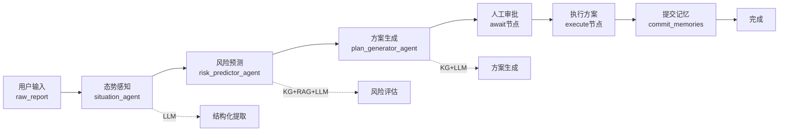

# 当前项目智能体功能说明

> 更新日期: 2025-10-21  
> 项目: emergency-agents-langgraph  
> 已实现智能体: 3/15 (20%)  

---

## 📊 实现概览

```
已实现 ✅: 3个核心智能体
未实现 ⏳: 12个智能体
完成度: 20%
```

## 🆕 对外接口补充

### 救援评估报告接口 `POST /reports/rescue-assessment`

- **用途**: 生成前突侦察指挥组面向省级指挥大厅的灾情汇报。  
- **请求模型**: `RescueAssessmentInput`，字段划分为 `basic`、`casualties`、`disruptions`、`infrastructure`、`agriculture`、`resources`、`support_needs`、`risk_outlook`、`operations` 九个板块，指标对齐《GB/T 24438.1-2025 自然灾害灾情统计 第1部分：基本指标》及《辽宁省自然灾害灾情统计报送和核查工作办法（暂行）》要求。  
- **生成策略**: 服务端先将结构化数据转换为中文分区 JSON，再调用 `build_rescue_assessment_prompt` 拼装提示词，并通过熔断 LLM 客户端 (`FailoverLLMClient`) 以温度 0.2、最大 1500 tokens 同步生成汇报，强制保留原始数字与地名，缺失信息由模型输出“待补充”。  
- **异常处理**: LLM 请求报错会记录 `rescue_assessment_generation_failed`，对外返回 `502 模型生成失败`；若模型返回空内容则抛出 `rescue_assessment_empty_response`。  
- **响应模型**: `RescueAssessmentResponse`，包含 Markdown 正文 `report_text` 以及由服务端抽取的 `key_points`（死亡人数、经济损失、增援诉求、风险提示等），便于前端高亮展示。  
- **测试覆盖**: `tests/api/test_rescue_assessment.py` 覆盖成功流程、模型失败兜底、请求校验失败三类场景。

### 工作流程图



---

## ✅ 已实现的智能体（3个）

### 1. 态势感知智能体 (situation_agent)

**文件位置**: `src/emergency_agents/agents/situation.py`

#### 核心功能
从非结构化的灾情报告中提取结构化信息

#### 工作流程
```
输入: raw_report (非结构化文本)
  ↓
LLM提取 (使用Prompt Engineering)
  ↓
JSON解析 (容错处理)
  ↓
输出: situation (结构化JSON)
```

#### 提取的信息
```json
{
  "disaster_type": "earthquake/flood/fire/chemical_leak/landslide",
  "magnitude": 7.8,
  "epicenter": {"lat": 31.0, "lng": 103.4},
  "depth_km": 14,
  "time": "2025-01-15T14:28:00Z",
  "affected_area": "汶川县",
  "nearby_facilities": ["水库", "化工厂"],
  "initial_casualties": {"estimated": 1000, "confirmed": 100}
}
```

#### 关键特性
- ✅ **幂等性保证**: 如果`situation`已存在，跳过LLM调用
- ✅ **容错JSON解析**: 支持3种解析策略
  1. 直接解析JSON
  2. 提取markdown代码块中的JSON
  3. 正则提取`{...}`内容
- ✅ **审计日志**: 记录所有AI决策
- ✅ **两阶段提交**: 准备记忆到`pending_memories`
- ✅ **时间轴追踪**: 记录态势更新事件

#### 输入 → 输出映射
| 输入字段 | 输出字段 | 说明 |
|---------|---------|------|
| `raw_report` | `situation` | 结构化的态势信息 |
| - | `timeline` | 追加"situation_updated"事件 |
| - | `pending_memories` | 准备提交的记忆 |

#### 错误处理
- JSON解析失败 → 返回默认值（disaster_type="unknown"）
- LLM调用失败 → 返回错误信息到`last_error`

---

### 2. 风险预测智能体 (risk_predictor_agent)

**文件位置**: `src/emergency_agents/agents/risk_predictor.py`

#### 核心功能
基于当前态势预测次生灾害和复合风险

#### 工作流程
```
输入: situation
  ↓
1. KG查询TRIGGERS关系 (主灾害→次生灾害)
  ↓
2. RAG检索相似历史案例 (top_k=3)
  ↓
3. LLM综合分析 (KG预测 + 历史案例)
  ↓
4. KG查询COMPOUNDS关系 (复合风险)
  ↓
输出: predicted_risks, secondary_disasters, compound_risks
```

#### 预测的风险信息
```json
{
  "predicted_risks": [
    {
      "type": "flood",
      "display_name": "洪水",
      "probability": 0.75,
      "severity": "high",
      "eta_hours": 2,
      "rationale": "震中附近有水库，地震可能导致大坝裂缝"
    }
  ],
  "risk_level": 4,
  "timeline": [
    {"time": "T+0h", "event": "地震发生"},
    {"time": "T+2h", "event": "预测洪水风险"}
  ]
}
```

#### 关键特性
- ✅ **三层推理**:
  1. **知识图谱推理**: 查询灾害因果关系（TRIGGERS）
  2. **案例检索**: RAG查询历史相似案例
  3. **LLM综合**: 融合KG和RAG结果生成预测
- ✅ **复合风险识别**: 自动检测多灾害叠加效应
- ✅ **增量合并**: 同类型风险做upsert（保留历史 + 更新最新）
- ✅ **灾害名称标准化**: 统一灾害类型命名
- ✅ **审计日志**: 记录风险预测决策

#### Knowledge Graph查询
```cypher
# TRIGGERS关系查询
MATCH (d:Disaster {name: $primary_type})-[r:TRIGGERS]->(s:Disaster)
WHERE r.probability >= 0.5
RETURN s.name, r.probability, r.delay_hours, r.condition

# COMPOUNDS关系查询
MATCH (d1:Disaster)-[r:COMPOUNDS]->(d2:Disaster)
WHERE d1.name IN $disaster_ids AND d2.name IN $disaster_ids
RETURN r.severity_multiplier, r.type, r.description
```

#### 输入 → 输出映射
| 输入字段 | 输出字段 | 说明 |
|---------|---------|------|
| `situation.disaster_type` | `predicted_risks` | 预测的次生灾害列表 |
| `situation.magnitude` | `risk_level` | 综合风险等级(1-5) |
| `situation.nearby_facilities` | `compound_risks` | 复合风险列表 |
| - | `secondary_disasters` | 简化的次生灾害列表 |
| - | `hazards` | 所有活跃的灾害类型 |

---

### 3. 方案生成智能体 (plan_generator_agent)

**文件位置**: `src/emergency_agents/agents/plan_generator.py`

#### 核心功能
基于态势和风险预测生成救援方案

#### 工作流程
```
输入: situation + predicted_risks
  ↓
1. KG查询所需装备 (REQUIRES关系)
  ↓
2. LLM生成救援方案 (分阶段任务)
  ↓
3. 生成proposals (待审批)
  ↓
输出: proposals, plan, alternative_plans, equipment_recommendations
```

#### 生成的方案结构
```json
{
  "primary_plan": {
    "name": "主救援方案",
    "priority": "P0",
    "objectives": ["目标1", "目标2"],
    "phases": [
      {
        "phase": "初期响应",
        "duration_hours": 2,
        "tasks": ["任务1", "任务2"],
        "required_equipment": ["生命探测仪", "救援艇"],
        "personnel": 50
      }
    ],
    "estimated_duration_hours": 48,
    "estimated_cost": 5000000
  },
  "alternative_plans": [
    {
      "name": "备选方案1",
      "priority": "P1",
      "difference": "不同之处说明"
    }
  ],
  "critical_warnings": ["警告1", "警告2"]
}
```

#### Proposal结构（人工审批）
```json
{
  "id": "uuid-xxxx",
  "type": "execute_rescue_plan",
  "params": {
    "plan": { /* primary_plan */ },
    "disaster_type": "earthquake",
    "magnitude": 7.8
  },
  "rationale": "基于earthquake(强度7.8)及3个预测风险的综合分析",
  "risk_level": 4,
  "requires_approval": true
}
```

#### 关键特性
- ✅ **装备智能推荐**: 从KG查询灾害所需装备
- ✅ **分阶段方案**: 自动拆解为初期响应、救援、恢复等阶段
- ✅ **多方案比选**: 生成主方案+备选方案
- ✅ **成本估算**: 预估持续时间和成本
- ✅ **人工审批机制**: 生成proposals供HITL确认
- ✅ **UUID追踪**: 每个方案分配唯一ID

#### Knowledge Graph查询
```cypher
# REQUIRES关系查询
MATCH (d:Disaster)-[r:REQUIRES]->(e:Equipment)
WHERE d.name IN $disaster_types
RETURN e.name, e.display_name, 
       SUM(r.quantity) as total_quantity,
       MAX(r.urgency) as max_urgency,
       COLLECT(d.name) as for_disasters
```

#### 输入 → 输出映射
| 输入字段 | 输出字段 | 说明 |
|---------|---------|------|
| `situation` | `proposals` | 待审批的方案列表 |
| `predicted_risks` | `plan` | 推荐的主方案 |
| - | `alternative_plans` | 备选方案列表 |
| - | `equipment_recommendations` | 装备推荐清单 |
| - | `status` | 设置为"awaiting_approval" |

---

## 🔄 工作流节点（LangGraph）

### 核心节点

| 节点名 | 功能 | 智能体 | 说明 |
|-------|------|--------|------|
| `situation` | 态势感知 | situation_agent | 提取结构化信息 |
| `risk_prediction` | 风险预测 | risk_predictor_agent | 预测次生灾害 |
| `plan` | 方案生成 | plan_generator_agent | 生成救援方案 |
| `await` | 人工审批 | - | **中断点**，等待用户审批 |
| `execute` | 执行方案 | - | 执行已批准的proposals |
| `commit_memories` | 提交记忆 | - | 两阶段提交到Mem0 |
| `approve` | 完成 | - | 设置状态为completed |

### 节点连接关系
```
situation → risk_prediction → plan → await → execute → commit_memories → (END)
```

### 特殊机制

#### 1. 中断机制 (HITL - Human In The Loop)
```python
# await节点
def await_node(state: RescueState) -> dict:
    payload = {"proposals": state.get("proposals", [])}
    approved_ids = interrupt(payload)  # 中断并等待外部输入
    return {"approved_ids": approved_ids}
```

**使用方式**:
```python
# 1. 启动工作流
result = app.invoke({"raw_report": "..."}, thread_id="xxx")
# → 执行到await节点后自动中断

# 2. 查看proposals
proposals = result["proposals"]

# 3. 用户审批后恢复
result = app.invoke(
    Command(resume=["proposal-id-1", "proposal-id-2"]),
    thread_id="xxx"
)
# → 继续执行execute节点
```

#### 2. 两阶段提交 (Mem0一致性保证)
```
准备阶段 (各个agent):
  state["pending_memories"].append({...})
  
提交阶段 (commit_memories节点):
  if checkpoint成功:
    mem0.add_many(pending_memories)
    state["committed_memories"] = pending_memories
    state["pending_memories"] = []
```

#### 3. 审计日志 (全链路追溯)
```python
log_ai_decision(
    rescue_id="xxx",
    user_id="yyy",
    agent_name="situation_agent",
    decision_type="situation_analysis",
    decision_data={...}
)
```

**日志类型**:
- `AI_DECISION`: AI智能体的决策
- `HUMAN_APPROVAL`: 人工审批记录
- `EXECUTION`: 方案执行结果

---

## 📦 依赖服务

### 1. Knowledge Graph (Neo4j)

**用途**: 灾害因果关系推理

**Schema**:
```cypher
# 节点类型
(Disaster) - 灾害类型
(Equipment) - 装备
(Facility) - 设施

# 关系类型
TRIGGERS - 触发次生灾害
COMPOUNDS - 复合风险
REQUIRES - 所需装备
```

**数据初始化**:
```bash
python -m emergency_agents.graph.kg_seed
```

### 2. RAG (Qdrant)

**用途**: 历史案例检索

**Collection**: 
- `cases` - 历史救援案例
- `regulations` - 行业规范
- `experience` - 经验知识

**查询示例**:
```python
cases = rag_pipeline.query(
    question="地震 次生灾害 汶川",
    domain="案例",
    top_k=3
)
```

### 3. LLM (OpenAI-compatible API)

**用途**: 
- 态势感知：结构化提取
- 风险预测：综合分析
- 方案生成：任务规划

**支持的模型**:
- glm-4 (默认)
- gpt-4
- gpt-3.5-turbo
- 其他OpenAI兼容模型

### 4. Mem0 (长期记忆)

**用途**: 存储关键决策和知识

**存储内容**:
- 态势分析结果
- 风险预测结果
- 救援方案
- 执行结果

---

## 📊 数据流转

### State结构 (RescueState)
```python
{
    # 基础信息
    "rescue_id": str,          # 救援任务ID
    "user_id": str,            # 用户ID
    "status": str,             # 状态: init/awaiting_approval/running/completed/error
    
    # 输入数据
    "raw_report": str,         # 原始灾情报告
    
    # 态势感知输出
    "situation": dict,         # 结构化态势信息
    "primary_disaster": dict,  # 主灾害
    
    # 风险预测输出
    "predicted_risks": list,   # 预测风险列表
    "secondary_disasters": list, # 次生灾害
    "compound_risks": list,    # 复合风险
    "risk_level": int,         # 风险等级(1-5)
    "hazards": list,           # 所有活跃灾害
    
    # 方案生成输出
    "proposals": list,         # 待审批方案
    "plan": dict,              # 推荐方案
    "alternative_plans": list, # 备选方案
    "equipment_recommendations": list, # 装备推荐
    
    # 审批和执行
    "approved_ids": list,      # 已批准的proposal ID
    "executed_actions": list,  # 已执行的动作
    
    # 记忆管理
    "pending_memories": list,  # 待提交记忆（两阶段提交）
    "committed_memories": list, # 已提交记忆
    
    # 时间轴
    "timeline": list,          # 事件时间轴
    
    # 错误处理
    "last_error": dict,        # 最后的错误信息
    "error_count": int,        # 错误计数
}
```

---

## ⏳ 未实现的智能体（12个）

根据需求文档，还需要实现以下智能体：

| ID | 智能体名称 | 功能描述 | 优先级 | 对应需求文档阶段 |
|----|-----------|---------|-------|----------------|
| 4 | 动态路径规划智能体 | 道路通行性、风险规避、最优路径 | P0 | 机动前突 |
| 5 | 智能资源调度智能体 | 人力物资编组、多目标优化 | P0 | 准备/主体救援 |
| 6 | 空中侦察智能体 | 无人机航线规划、载荷切换、成果回传 | P1 | 现场侦察 |
| 7 | 地面侦察智能体 | 无人车/机器狗穿越、精细探查 | P1 | 现场侦察 |
| 8 | 水域侦察智能体 | 无人艇巡查、水流评估、搜救协同 | P2 | 现场侦察 |
| 9 | 任务智能分发智能体 | 方案拆解为任务卡、分发到队伍APP | P0 | 主体救援 |
| 10 | 态势自动标绘智能体 | 实体抽取、"一张图"维护 | P1 | 所有阶段 |
| 11 | 效果评估智能体 | 行动数据采集、量化评估、复盘 | P2 | 效果评估 |
| 12 | 多机协同控制智能体 | 编队队形、频谱调度、避障 | P1 | 现场侦察 |
| 13 | 预警监测智能体 | 关键风险点守望、异常趋势通报 | P1 | 所有阶段 |
| 14 | 通信协调智能体 | 多链路切换、带宽分配 | P0 | 所有阶段 |
| 15 | 知识推理智能体 | 因果推理、约束推理、案例引用 | P1 | 所有阶段 |
| 16 | 模拟推演智能体 | 虚拟沙盘、方案鲁棒性评估 | P2 | 准备阶段 |

---

## 🎯 实施建议

### 短期（2周）- P0级智能体

1. **动态路径规划智能体**
   - 复用现有态势感知能力
   - 集成地图API（高德/百度）
   - 实现A*算法
   
2. **智能资源调度智能体**
   - 扩展plan_generator的能力
   - 实现约束求解器
   - 集成装备库数据

3. **任务智能分发智能体**
   - 方案→任务卡的自动拆解
   - 集成队伍APP接口
   - 实现任务回执机制

### 中期（1个月）- P1级智能体

4. **侦察智能体（空/地/水）**
   - 统一的侦察任务抽象
   - 特化的平台适配层
   - 目标识别集成（YOLO）

5. **态势自动标绘智能体**
   - 实体识别（NER）
   - 地理编码
   - 3D地图渲染

6. **通信协调智能体**
   - 链路监控
   - 自适应切换
   - 带宽QoS

### 长期（3个月）- P2级智能体

7. **效果评估智能体**
8. **模拟推演智能体**
9. **其他辅助智能体**

---

## 📚 参考文档

- **代码实现总结**: `IMPLEMENTATION_SUMMARY.md`
- **需求文档**: 
  - `docs/需求/AI应急大脑与全空间智能车辆系统.md`
  - `/home/msq/gitCode/new_1/准备阶段.txt`
  - `/home/msq/gitCode/new_1/机动前突阶段.txt`
  - `/home/msq/gitCode/new_1/现场侦察阶段.txt`
  - `/home/msq/gitCode/new_1/主体救援阶段.txt`
- **五层Linus式分析**: `docs/分析报告/五层Linus式深度分析-AI应急大脑系统完整评估.md`

---

**最后更新**: 2025-10-21  
**维护者**: AI Agent  
**版本**: v1.0


